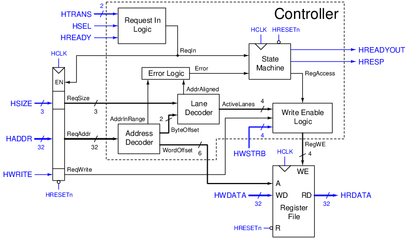
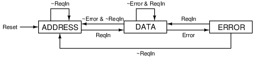

# AHB Register Module

This is a simple register module that stores data via AHB protocol.

## Requirements
- The module has an AHB-Lite slave interface (32-bit address and data width).
- All registers hold `0` after reset.
- When a write occurs, the corresponding register stores the data until reset or overwritten.
- When a read occurs, the corresponding register returns the stored data.
- Valid reads and writes are finished in 2 cycles (1 for address phase and 1 for data phase).
- Error responses are finished in 3 cycles (1 for address phase and 2 for error signal).
- `HADDR` must be in the address space. Out-of-range address raises an error.
- `HADDR` must be aligned (based on `HSIZE`). Unaligned address raises an error.
- Byte order is little-endian.
- Write strobes `HWSTRB` is supported.
- Burst mode `HBURST` is not supported (since the data can be accessed in 1 cycle anyway).

## Structure
### Block diagram

| Component | Description |
| --- | --- |
| Register file | The main functionality of the module. A memory that can store 64 words. |
| Request register (left) | Stores the request given in the address phase to be used in the data phase. |
| Request in logic | Decides when to take in new request (`HSEL = 1` and `HREADY = 1` and `HTRANS` is either `NONSEQ` or `SEQ`). |
| Address decoder | Decomposes the address into components and checks if it is in the address space. |
| Lane decoder | Returns the active lanes from `HSIZE` and the current address. |
| Error logic | Determines if an error happens (address is out of range or unaligned). |
| State machine | Stores the state of the controller (address phase or data phase). |
| Write enable logic | Decides when to write to the register file and at which lanes. |

### State machine

| State | Description | `HREADYOUT` | `HRESP` | `RegAccess` |
| --- | --- | --- | --- | --- |
| `ADDRESS` | Address phase of the AHB protocol. | 1 | 0 | 0 |
| `DATA` | Data phase of the AHB protocol. If `Error` happens, it becomes the first cycle of an error response. | `~Error` | `Error` | `~Error` |
| `ERROR` | The second cycle of the error response. | 1 | 1 | 0 |

## Customization
The size and address can be adjusted with the `NumWords` and `BaseAddr` parameters.
The address space is `4 * NumWords` bytes (since there are 4 bytes in a word), starting from `BaseAddr`.
For example, for `NumWords = 64` and `BaseAddr = 32'h4000_1000`, the address space ranges
from `32'h4000_1000` to `32h4000_10FF` (256 bytes).

`BaseAddr` must be aligned to the address space.
For example, if `NumWords = 64` (256 bytes address space), then the last 8 bits of `BaseAddr` must be `0`.
This means `32h4000_0100` is a valid `BaseAddr` while `32h4000_0010` is invalid.

