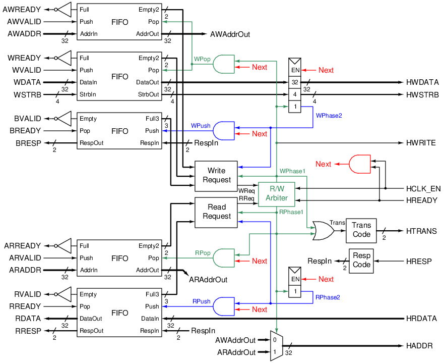
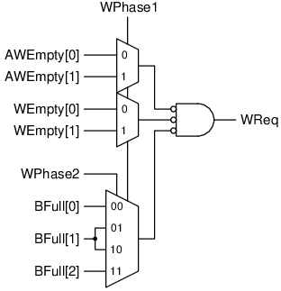
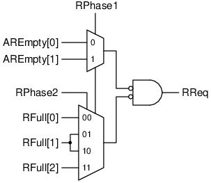
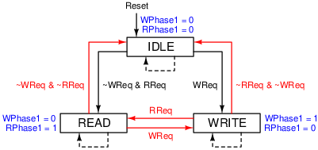

# AXI-AHB Bridge

This is an implementation of a bridge between an AXI-Lite master and an AHB slave.

## Requirements
- The module has an AXI-Lite slave interface and an AHB-Lite master interface (both have 32-bit address and data width).
- AXI and AHB clock domains are synchronous, where the rising edge of `HCLK` is indicated by the `HCLK_EN` signal.
- Read and write requests are handled in a round-robin fashion (1 read, then 1 write, then 1 read, etc.).
- Support 2-bit error response (`BRESP` and `RRESP`).
- If the AHB slave raises an error (`HRESP = 1`), then the AXI interface returns a `SLVERR` response (`xRESP = 0b10`).
- Unaligned access behaviour is defined by the connected AHB slave.
- Write strobes `WSTRB` is supported.
- `xID` and `AxID` are not supported.
- Transfer size `AxSIZE` is not supported.

## Structure
### Block diagram



### Components
#### FIFO
First in first out, used to buffer the channels.
The FIFOs ignore a push when full and a pop when empty.
The output `EmptyK` is a `K`-bit signal, indicating the conditions
when there are `0`, `<= 1`, `<= 2`, ..., `<= K-1` elements in the FIFO.
Symmetrically, the output `FullK` indicates the conditions
when there are `N`, `>= N-1`, `>= N-2`, ..., `>= N-K+1` elements in the FIFO.

#### Write request
This component decides if a write request can be handled by the module.
A write request can be handled if the `AW` and `W` FIFOs are not empty and the `B` FIFO is not full.
However, this condition must take into account the number of pending pops and pushes.
For example, if there is 1 pending pop, then the `AW` and `W` FIFOs need to have 1 more element to be counted as a valid request.
Overall, we have the expressions:
```
WReq = ~AWEmpty[PendingPop] & ~WEmpty[PendingPop] & ~BFull[PendingPush]
PendingPop = WPhase1
PendingPush = WPhase1 + WPhase2
```



#### Read request
Same as write request but for `R` and `B` channels.
```
RReq = ~AREmpty[PendingPop] & ~RFull[PendingPush]
PendingPop = RPhase1
PendingPush = RPhase1 + RPhase2
```



#### R/W arbiter
This module allocates the use of the AHB interface to process either the read or the write request.
It is a round-robin arbiter, implemented as the following FSM (dashed lines are default transitions).
Transitions only happen when `HCLK_EN` is asserted. Red transitions are also gated by `HREADY`.



#### Trans code
This returns the code for `HTRANS` based on `Trans` signal.
| `Trans` | `HTRANS` |
| --- | --- |
| `0` | `00 (IDLE)` |
| `1` | `10 (NONSEQ)` |

#### Resp code
This returns the response code `xRESP` based on `HRESP` signal.
| `HRESP` | `RespIn` |
| --- | --- |
| `0` | `00 (OK)` |
| `1` | `10 (SLVERR)` |

## Customization
The depth of the FIFOs can be configured with the `FifoDepth` parameter (must be a power of 2), defaulting to 8.

