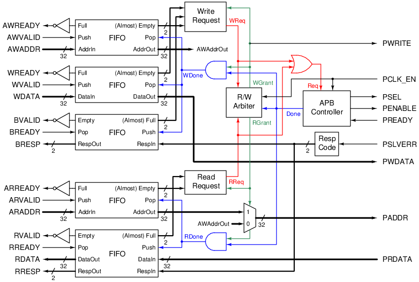

# AXI-APB Bridge

This is an implementation of a bridge between an AXI-Lite master and an APB slave.

## Requirements
- The module has an AXI-Lite slave interface and an APB master interface (both have 32-bit address and data width).
- AXI and APB clock domains are synchronous, where the rising edge of `PCLK` is indicated by the `PCLK_EN` signal.
- Read and write requests are handled in a round-robin fashion (1 read, then 1 write, then 1 read, etc.).
- Support 2-bit error response (`BRESP` and `RRESP`).
- If the APB slave raises an error (`PSLVERR = 1`), then the AXI interface returns a `SLVERR` response (`xRESP = 0b10`).
- Unaligned access behaviour is defined by the connected APB slave.
- Write strobes `WSTRB` is not supported.
- `xID` and `AxID` are not supported.
- Transfer size `AxSIZE` is not supported.

## Structure
### Block diagram

### Components
#### FIFO
First in first out, used to buffer the channels.
The FIFOs ignore a push when full and a pop when empty.
The outputs with `(Almost)` have an extra signal for `AlmostEmpty` or `AlmostFull`.
`AlmostEmpty` is true when there is at most 1 items in the buffer.
`AlmostFull` is true when there is at least `N-1` items in the buffer.

#### Write request
This component decides if a write request can be handled by the module.
A write request can be handled if the `AW` and `W` FIFOs are not empty and the `B` FIFO is not full.
If a write request is being processed (`WGrant = 1`),
then this component returns whether the next request can be handled,
using the same logic but with `AlmostEmpty` and `AlmostFull` signals.

#### Read request
Same as write request but for `R` and `B` channels.

#### R/W arbiter
This module allocates the use of APB controller to process either the read or the write request.
It is a round-robin arbiter, implemented as the following FSM (dashed lines are default transitions).
Transitions only happen when `Done` is asserted.

#### APB controller
An FSM that generates the control signals for the APB master interface.
Transitions only happen when `PCLK_EN` is asserted.
`Done` is asserted only for 1 cycle at the marked transitions.

#### Resp code
This returns the response code `xRESP` based on `PSLVERR` signal.

## Customization
The depth of the FIFOs can be configured with the `FifoDepth` parameter (must be a power of 2), defaulting to 8.

