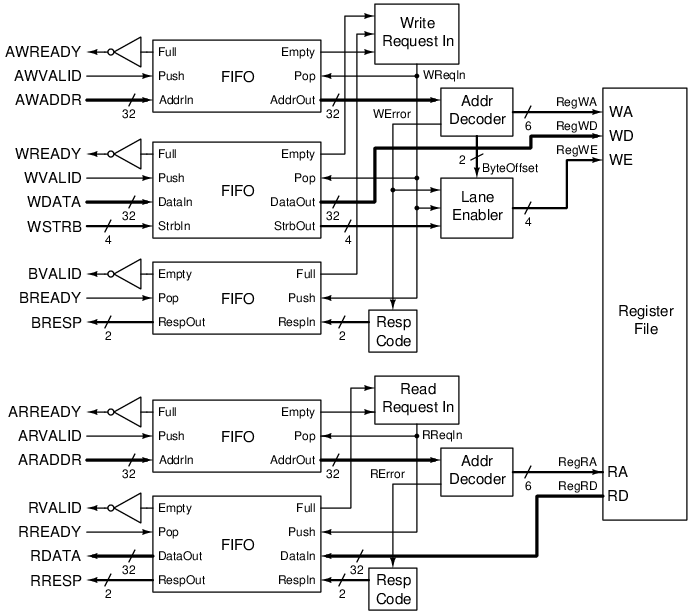

# AXI Register Module

This is a simple register module that stores data via AXI-Lite protocol.

## Requirements
- The module has an AXI-Lite slave interface (32-bit address and data width).
- All registers hold `0` after reset.
- When a write occurs, the corresponding register stores the data until reset or overwritten.
- When a read occurs, the corresponding register returns the stored data.
- Read/write throughtput is 100%.
- Read/write latency is 2 cycles.
- Support 2-bit error response (`BRESP` and `RRESP`).
- Out-of-range address raises an error response (`DECERR = 0b11`).
- Byte order is little-endian.
- Write strobes `WSTRB` is supported.
- `xID` and `AxID` are not supported.
- Transfer size `AxSIZE` is not supported.

## Structure
### Block diagram

| Component | Description |
| --- | --- |
| Register file | The main functionality of the module. A memory that can store 64 words. |
| FIFO | First in first out, used to buffer the channels. The FIFOs ignore a push when full and a pop when empty.  |
| Request in logic | Decides when to take in new request (can pop all the inputs and push to the output). |
| Addr decoder | Decomposes the address into components and checks if it is in the address space. |
| Lane enabler | Enables the corresponding byte lanes in a write. |
| Resp code | Returns the response code based on the error input. |

## Customization
The size and address can be adjusted with the `NumWords` and `BaseAddr` parameters.
The address space is `4 * NumWords` bytes (since there are 4 bytes in a word), starting from `BaseAddr`.
For example, for `NumWords = 64` and `BaseAddr = 32'h4000_1000`, the address space ranges
from `32'h4000_1000` to `32h4000_10FF` (256 bytes).

`BaseAddr` must be aligned to the address space.
For example, if `NumWords = 64` (256 bytes address space), then the last 8 bits of `BaseAddr` must be `0`.
This means `32h4000_0100` is a valid `BaseAddr` while `32h4000_0010` is invalid.

The depth of the FIFOs can be configured with the `FifoDepth` parameter, defaulting to 4.

