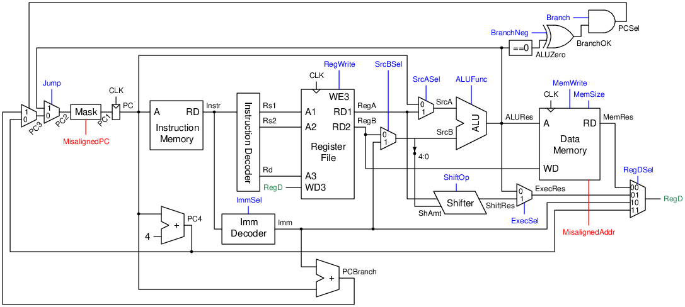

# RISC-V Nonpipelined Processor

This is a barebone implementation of the RISC-V architecture without pipelining and any extension.

## Requirements
- Supports all instructions of the RV32I instruction set.
- Instruction and data memories have no latency.
- `FENCE` is treated as `NOP`.
- `ECALL` and `EBREAK` halt the processor and raise the `Halt` output.
- Invalid OpCode are treated as `EBREAK`.
- If `Continue` is high, resume execution from a halt.

## Structure
### Datapath

### Controller

- `ShiftOp` is wired to `{Funct7[5], Funct3[2]}`.
- In `ALUDec`, `ALUCode = Funct3 | {2'b00, Funct7[5]}` if `Recode == 1` to encode for `SUB`,
otherwise `ALUCode = Funct3`.

#### Main Decoder

| `OpCode`           | `funct3` | `ImmSel` | `SrcASel` | `SrcBSel` | `ALUSet` | `ALUOp` | `ShAmtSel` | `RegWrite` | `RegDSel` |
|--------------------|----------|----------|-----------|-----------|----------|---------|------------|------------|-----------|
| `0010011 (OP-IMM)` | `x01`    |          |           |           |          |         | `1`        | `1`        | `10`      |
| `0010011 (OP-IMM)` | Others   | `000`    | `1`       | `1`       | `0`      |         |            | `1`        | `01`      |
| `0110011 (OP)`     | `x01`    |          |           |           |          |         | `0`        | `1`        | `10`      |
| `0110011 (OP)`     | Others   |          | `1`       | `0`       | `0`      |         |            | `1`        | `01`      |
| `0110111 (LUI)`    |          | `010`    |           |           |          |         |            | `1`        | `11`      |
| `0010111 (AUIPC)`  |          | `010`    | `0`       | `1`       | `1`      | `000`   |            | `1`        | `01`      |
| `0000011 (LOAD)`   |          | `000`    | `1`       | `1`       | `1`      | `000`   |            | `1`        | `00`      |
| `0100011 (STORE)`  |          | `001`    | `1`       | `1`       | `1`      | `000`   |            | `0`        |           |

- Empty cells are filled with don't care (`x`).
- `MemWrite = 1` iff `Opcode == 0100011 (STORE)`. 
- `Recode = 1` iff `Opcode == 7'b0110011 (OP)`.

### Data Memory

| `MemSize` | Description |
|-|-|
| `000` | Byte (8-bit) |
| `001` | Half-word (16-bit) |
| `010` | Word (32-bit) |
| `100` | Byte with signed extension |
| `101` | Half-word with signed extension |

### ALU

| `F[2:0]` | Operation |
| --- | --- |
| `000` | Addition `A + B` |
| `001` | Subtraction `A - B` |
| `010` | Set if less than (SLT) `A < B` |
| `011` | Set if less than unsigned (SLTU) |
| `10x` | XOR `A ^ B` |
| `110` | OR <code>A &#124; B</code> |
| `111` | AND `A & B` |

### Shifter

| `F[1:0] = ShiftOp` | Operation | `B` | `C` | `K` |
| --- | --- | --- | --- | --- |
| `x0` | Left shift `A << ShAmt` | `A` | `32'h0` | `~ShAmt` |
| `01` | Logical right shift `A >> ShAmt` | `32'h0` | `A` | `ShAmt` |
| `11` | Arithmetic right shift `A >>> ShAmt` | `{32{A[31]}}` | `A` | `ShAmt` |

### Imm Decoder

| Type | `ImmSel` | `Imm`                |
|------|----------|----------------------|
| I    | `000`    | `{Sign, ImmI}`       |
| S    | `001`    | `{Sign, ImmS}`       |
| U    | `010`    | `{ImmU, 12'b0}`      |
| J    | `100`    | `{Sign, ImmJ, 1'b0}` |
| B    | `101`    | `{Sign, ImmB, 1'b0}` |

