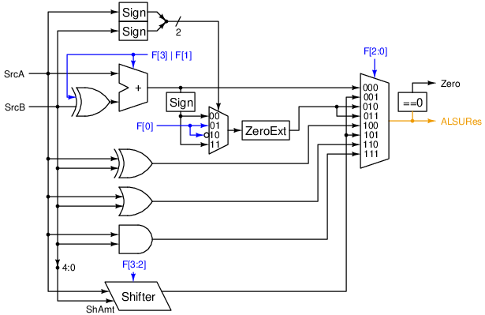

# RISC-V Pipelined Processor (In Progress)

This is a pipelined implementation of the RISC-V architecture without any extension.
The pipeline consists of 5 stages: Fetch (F), Decode (D), Execute (E), Memory (M), and Write-back (W).

## Requirements
- Supports all instructions of the RV32I instruction set.
- Instruction and data memories have no latency.
- `FENCE` is treated as `NOP`.
- `ECALL` and `EBREAK` halt the processor and raise the `Halted` output.
- If `Unhalt` is high, resume execution from a halt.
- Exception handling:
    - Invalid OpCode is treated as `EBREAK`.
    - Misaligned PC and data access are treated as `EBREAK`.
- Hazard resolution:
    - `OP-IMM`, `OP`, `LUI`, `AUIPC` don't stall the pipeline.
    - `LOAD`, `JAL` stall the pipeline for 1 cycle.
    - `JALR` stalls the pipeline for 2 cycles.
    - `BRANCH` stalls the pipeline for 2 cycles if the branch is taken.
    - `STORE`, `MISC`, and `SYSTEM` do not produce hazards.

## Pipeline
The following table describes the actions taken by different instructions at each stage in the pipeline.
Bold text indicates that the write-back result (`RegD`) is available after that stage, which can be forwarded
to previous stages in order to solve read-after-write (RAW) dependencies.

| Instruction    | Fetch                          | Decode                                   | Execute                            | Memory       | Write-back |
|----------------|--------------------------------|------------------------------------------|------------------------------------|--------------|------------|
| `OP-IMM`, `OP` | Fetch instr                    | Decode instr<br>Read reg                 | **Calc with ALU**                  |              | Write reg  |
| `LUI`          | Fetch instr                    | Decode instr                             |                                    |              | Write reg  |
| `AUIPC`        | Fetch instr                    | Decode instr<br>Read reg                 | **Add PC + imm**                   |              | Write reg  |
| `LOAD`         | Fetch instr                    | Decode instr<br>Read reg                 | Add base + offset                  | **Read mem** | Write reg  |
| `STORE`        | Fetch instr                    | Decode instr<br>Read reg                 | Add base + offset                  | Write mem    |            |
| `JAL`          | Fetch instr<br>**Calc PC + 4** | Decode instr<br>Add PC + imm<br>Write PC |                                    |              | Write reg  |
| `JALR`         | Fetch instr<br>**Calc PC + 4** | Decode instr<br>Read reg                 | Add PC + imm<br>Write PC           |              | Write reg  |
| `BRANCH`       | Fetch instr                    | Decode instr<br>Read reg<br>Add PC + imm | Check branch condition<br>Write PC |              |            |

### Hazards
The pipeline has 2 types of hazards:
- RAW on the register file between the Decode stage and the Write-back stage. This only happens
when `rd[i] != 0` and `rd[i] == rs1[j]` or `rd[i] == rs2[j]` when `j = i+1`, `i+2`, or `i+3` (there are 3 stages from Decode to Write-back).
Except for the `LOAD` instruction, this type of hazards can be resolved by forwarding resulting in no pipeline stall.
- RAW on the PC between the Fetch stage and the Decode (`JAL`) or Execute (`JALR`, `BRANCH`) stages.
This type of hazards can only be resolved by stalling the pipeline.
`BRANCH` instructions can continue fetching the instructions, but if the branch is taken,
the fetched instructions in Fetch and Decode must be flushed.

### Structure
The following is the structural diagram of each pipeline stage.
The names of most signals contain suffices indicating the stages they are in:
Fetch (F), Decode (D), Execute (E), Memory (M), Write-back (W).
All registers are disabled by the `Halted` signal (not shown in the diagrams).
The meaning of the colors of the wires:
- Blue: datapath control;
- Green: signals for hazard detection;
- Orange: signals routed back to Fetch;
- Brown: forwarding paths or Write-back signals;
- Purple: pipeline control (flush/stall);
- Red: signals to the [Halt Controller](#halt-control);

#### Fetch


- `Mask` replaces the 0th bit with a zero, raises an exception if the 1st bit is one.
- `NOP` returns a constant `NOP` instruction.
- On reset, `PCF` is set to `0`, `InstrD` is set to `NOP`. The initial values of other registers don't matter.

#### Decode


- `Register File` writes on falling edges.
- `Decomposer` maps `Rs1`, `Rs2`, and `Rd` to the corresponding bits in `InstrD`.
- If `Stall | Flush`, `NOP Mask` forces `MemReadD = 0`, `MemWriteD = 0`, `RdValidD = 0`, `FlowCtrlD = 000`. Otherwise, it keeps the inputs unchanged.
- On reset, it holds that `MemReadE = 0`, `MemWriteE = 0`, `RdValidE = 0`, `FlowCtrlE = 000`. The initial values of other registers don't matter.
- For more details, see [Controller](#controller), [Hazard Unit](#hazard-unit), and [Imm Decoder](#imm-decoder).

#### Execute


- `ExecResM` is the forwarding path for the result of the Execute stage.
- `RegDW` is the forwarding path for the result of the Memory stage.
- On reset, it holds that `MemReadM = 0`, `MemWriteM = 0`, `RdValidM = 0`. The initial values of other registers don't matter.
- For more details, see [Fwd Mux](#fwd-mux), [Src Mux](#src-mux), [ALSU](#alsu), and [Flow Control](#flow-control).

#### Memory


- On reset, it holds that `RdValidW = 0`. The initial values of other registers don't matter.
- For more details, see [Data Memory](#data-memory).

#### Write-back


## Components
### Controller
`Controller` decodes `OpCode`, `funct3`, and `funct7[5]` to produce the corresponding control signals.

| `OpCode`          | `funct3`     | `RxValid`   | `ImmSel` | `SrcSel` | `ALSUFunc`    | `ExecSel`  | `{JumpD,FlowCtrl}` |
|-------------------|--------------|-------------|----------|----------|---------------|------------|--------------------|
| `0010011(OP-IMM)` | `x01(SHIFT)` | `10_1(A-D)` | `000(I)` | `01(RI)` | `g_fff(F37)`  | `00(ALSU)` | `0_000(PC4)`       |
| `0010011(OP-IMM)` | Others       | `10_1(A-D)` | `000(I)` | `01(RI)` | `0_fff(F3)`   | `00(ALSU)` | `0_000(PC4)`       |
| `0110011(OP)`     |              | `11_1(ABD)` |          | `00(RR)` | `g_fff(F37)`  | `00(ALSU)` | `0_000(PC4)`       |
| `0110111(LUI)`    |              | `00_1(--D)` | `010(U)` |          |               | `01(IMM)`  | `0_000(PC4)`       |
| `0010111(AUIPC)`  |              | `00_1(--D)` | `010(U)` | `11(PI)` | `0_000(ADD)`  | `00(ALSU)` | `0_000(PC4)`       |
| `0000011(LOAD)`   |              | `10_1(A-D)` | `000(I)` | `01(RI)` | `0_000(ADD)`  | `00(ALSU)` | `0_000(PC4)`       |
| `0100011(STORE)`  |              | `11_0(AB-)` | `001(S)` | `01(RI)` | `0_000(ADD)`  | `00(ALSU)` | `0_000(PC4)`       |
| `1101111(JAL)`    |              | `00_1(--D)` | `100(J)` |          |               | `10(PC4)`  | `1_000(JUMP_D)`    |
| `1100111(JALR)`   |              | `10_1(A-D)` | `000(I)` | `01(RI)` | `0_000(ADD)`  | `10(PC4)`  | `0_100(JUMP_E)`    |
| `1100011(BRANCH)` | `000(BEQ)`   | `11_0(AB-)` | `101(B)` | `00(RR)` | `1_000(SUB)`  |            | `0_010(BRANCH_Z)`  |
| `1100011(BRANCH)` | `001(BNE)`   | `11_0(AB-)` | `101(B)` | `00(RR)` | `1_000(SUB)`  |            | `0_011(BRANCH_NZ)` |
| `1100011(BRANCH)` | `100(BLT)`   | `11_0(AB-)` | `101(B)` | `00(RR)` | `0_010(SLT)`  |            | `0_011(BRANCH_NZ)` |
| `1100011(BRANCH)` | `101(BGE)`   | `11_0(AB-)` | `101(B)` | `00(RR)` | `0_010(SLT)`  |            | `0_010(BRANCH_Z)`  |
| `1100011(BRANCH)` | `110(BLTU)`  | `11_0(AB-)` | `101(B)` | `00(RR)` | `0_011(SLTU)` |            | `0_011(BRANCH_NZ)` |
| `1100011(BRANCH)` | `111(BGEU)`  | `11_0(AB-)` | `101(B)` | `00(RR)` | `0_011(SLTU)` |            | `0_010(BRANCH_Z)`  |
| `0001111(MISC)`   |              | `00_0(---)` |          |          |               |            | `0_000(PC4)`       |
| `1110011(SYSTEM)` |              | `00_0(---)` |          |          |               |            | `0_000(PC4)`       |
| Others            |              | `00_0(---)` |          |          |               |            | `0_000(PC4)`       |

- Empty cells are filled with don't care (`x`).
- `f` denotes bits from `funct3`; `g` denotes the bit `funct7[5]`. 
- `RxValid` consists of `{RsValid, RdValid}`.
- `MemWrite = 1` iff `Opcode == 0100011 (STORE)`. 
- `MemRead = 1` iff `Opcode == 0000011 (LOAD)`. 
- `MemSize` is hard-wired to `funct3`.
- `System = 1` iff `Opcode == 1110011 (SYSTEM)` or `Opcode` is illegal.

### Hazard Unit
`Hazard Unit` detects RAW hazards on the register file, then returns the controls for the forwarding paths
or stalls the pipeline if necessary. See Fwd Mux for the meanings of the bits in `FwdSelD`.

```systemverilog
always_comb begin
    FwdSelD = 4'b0000;
    Stall = 1'b0;

    if (RdValidE & RdE != 5'd0) begin
        FwdSelD[0] = Rs1 == RdE;
        FwdSelD[1] = Rs2 == RdE;
        Stall = MemReadE & (FwdSelD[0] | FwdSelD[1]);
    end

    if (RdValidM & RdM != 5'd0) begin
        FwdSelD[2] = Rs1 == RdM;
        FwdSelD[3] = Rs2 == RdM;
    end
end
```

### Imm Decoder
`Imm Decoder` produces the 32-bit immediate value of the correct type based on `ImmSel`.

| Type | `ImmSel` | `Imm`                |
|------|----------|----------------------|
| I    | `000`    | `{Sign, ImmI}`       |
| S    | `001`    | `{Sign, ImmS}`       |
| U    | `010`    | `{ImmU, 12'b0}`      |
| J    | `100`    | `{Sign, ImmJ, 1'b0}` |
| B    | `101`    | `{Sign, ImmB, 1'b0}` |

### Fwd Mux
`Fwd Mux` chooses the correct register data either from the register file or from the forwarding paths.
`ExecResM` (result of Execute) is prioritized over `RegDW` (result of Memory).
The meanings of the bits in `FwdSel` are:

| Bit | Forward from | Forward to |
|-----|--------------|------------|
| `0` | `ExecResM`   | `A`        |
| `1` | `ExecResM`   | `B`        |
| `2` | `RegDW`      | `A`        |
| `3` | `RegDW`      | `B`        |


### Src Mux
`Src Mux` chooses the source data for the ALSU, either from the register file or from the PC/immediate value.


### ALSU
`ALSU` (Arithmetic, Logic, and Shift Unit) is the primary computation unit.

| `F = ALSUFunc` | Operation                             |
|----------------|---------------------------------------|
| `0_000`        | Addition `A + B`                      |
| `1_000`        | Subtraction `A - B`                   |
| `x_001`        | Left shift `A << B[4:0]`              |
| `x_010`        | Set if less than (SLT) `A < B`        |
| `x_011`        | Set if less than unsigned (SLTU)      |
| `x_100`        | XOR `A ^ B`                           |
| `0_101`        | Logical right shift `A >> B[4:0]`     |
| `1_101`        | Arithmetic right shift `A >>> B[4:0]` |
| `x_110`        | OR <code>A &#124; B</code>            |
| `x_111`        | AND `A & B`                           |



#### Shifter
Sub-component of the ALSU, implemented as a funnel shifter.

| `F[3:2]` | Operation                            | `B`           | `C`     | `K`      |
|-----------------|--------------------------------------|---------------|---------|----------|
| `x0`            | Left shift `A << ShAmt`              | `A`           | `32'h0` | `~ShAmt` |
| `01`            | Logical right shift `A >> ShAmt`     | `32'h0`       | `A`     | `ShAmt`  |
| `11`            | Arithmetic right shift `A >>> ShAmt` | `{32{A[31]}}` | `A`     | `ShAmt`  |


### Flow Control
`Flow Control` produces signals to set the PC and flush the pipeline if necessary.
This component is used by the `JALR` and `BRANCH` instructions.
Note that `JAL` is handled in the Decode stage by the `JumpD` signal instead.

The meanings of the bits in `FlowCtrl` are:
| `FlowCtrl` Bit | Meaning                                                                                  |
|----------------|------------------------------------------------------------------------------------------|
| `0`            | If false, branch if the ALSU returns zero. If true, branch if the ALSU returns non-zero. |
| `1`            | Indicates that this is a `BRANCH` instruction                                           |
| `2`            | Indicates that this is a `JALR` instruction                                             |

The meanings of the bits in `PCSelE` are:
| `PCSelE` Bit | Meaning                                                                    |
|--------------|----------------------------------------------------------------------------|
| `0`          | If true, take the branch, set `PC` to `PCImm` (calculated in Decode stage) |
| `1`          | If true, unconditionally jump, set `PC` to `ALSURes`                       |

`Flush` is asserted on unconditional jumps or if the branch is taken.


### Data Memory
`Data Memory` prepares and translates the data before it is written or read from the RAM.
We assume that an access to the RAM must be word-aligned. The RAM also provides a 4-bit write strobes `WStrb` input
to indicate which byte to write (1 bit per byte, 4 bits for a word).


- `Addr Decoder` separates the `ByteOffset` (bits 1 and 0) and the `WordAddr` which is word-aligned.
- `Lane Decoder` combines `MemSize` and `ByteOffset` to produce the write strobes.
- `Write Shifter` and `Read Shifter` shifts the data based on the enabled `Lanes`.
- `Read Shifter` also needs `MemSize[2]` to choose the right extension (signed or unsigned).

The encoding of `MemSize`:

| `MemSize` | Description                       |
|-----------|-----------------------------------|
| `000`     | Byte (8-bit)                      |
| `001`     | Half-word (16-bit)                |
| `010`     | Word (32-bit)                     |
| `100`     | Byte with unsigned extension      |
| `101`     | Half-word with unsigned extension |

### Halt Control
`Halt Control` is simply a register outputting `Halted`.
- Whenever an exception raised (`MisalignedPC`, `MisalignedAddr`, `System`), the register is set.
- If `Unhalt` is asserted, the register is reset.
- `Halted` disabled all other registers.

